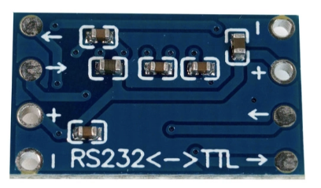

# Ecumaster EMU Classic HD44780 display #

Simple "dash" for EMU Classic based on Arduino and HD44780 screen.
Connects to EMU serial output on the expansion port.

## Elements ##

- Arduino Nano

  
- HD44780 with I2C interface

  

- MAX3232 RS232<>TTL converter

  
  

- GX16 5-pin connector

  

## Arduino IDE setup ##

- Install LiquidCrystal_I2C library
- Install EMUSerial library (Note: On Linux You need to modify `~/Arduino/libraries/EMUSerial/src/EMUSerial.h` file and
  replace `#include "arduino.h"` with `#include "Arduino.h"`)

## Hardware connections ##

### Arduino <> Display ###

| Arduino | Display |
|---------|---------|
| 5V      | VCC     |
| GND     | GND     |
| A4      | SDA     |
| A5      | SCL     |

### Arduino <> MAX3232 ###

| Arduino | MAX3232 (TTL side) |
|---------|--------------------|
| TX      | IN                 |
| RX      | OUT                |

### EMU <> MAX3232 ###

| EMU           | MAX3232 (RS232 side) |
|---------------|----------------------|
| RXD (pin 1)   | OUT                  |
| TXD (pin 2)   | IN                   |
| +3.3V (pin 3) | unused               |
| GND (pin 4)   | GND                  |
| +5V (pin 5)   | VCC                  |

### Wiring diagram ###

## Flashing assembled board ##

You won't be able to flash a fully assembled board due to the way in which TX and RX pins are wired on Arduino.

Before flashing board You need to disconnect TX and RX pins from the board.

## Case ##

### Required hardware ###

- 4 M4x50 bolts
- 4 M4 nuts
